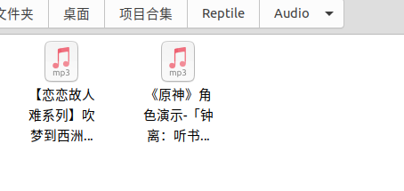
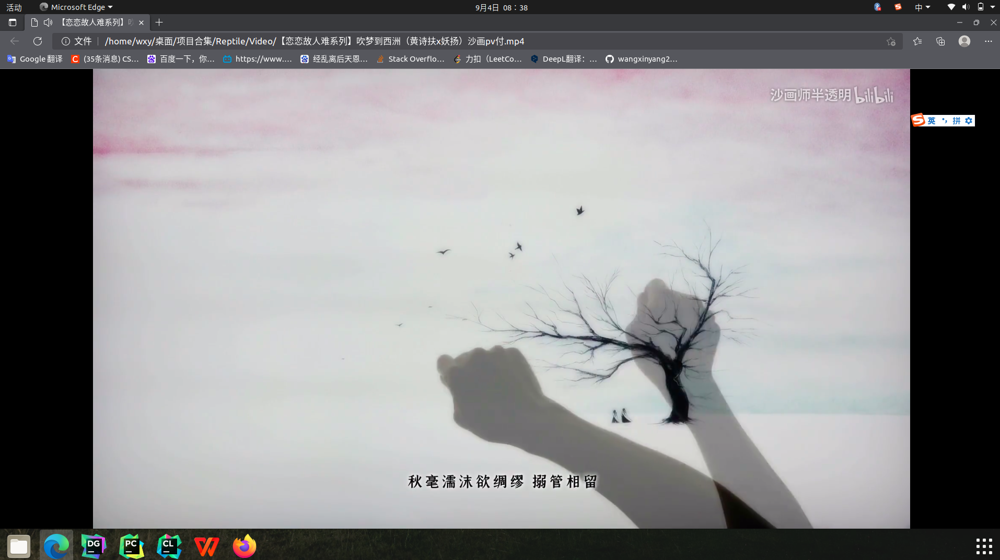
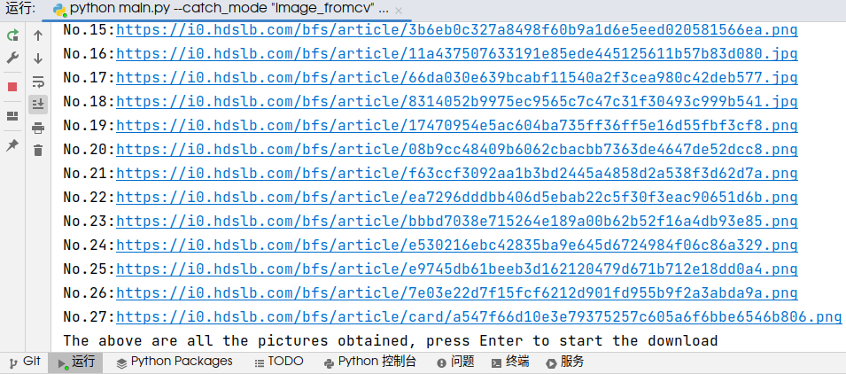
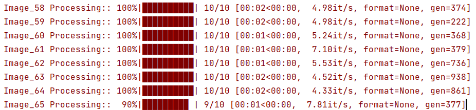
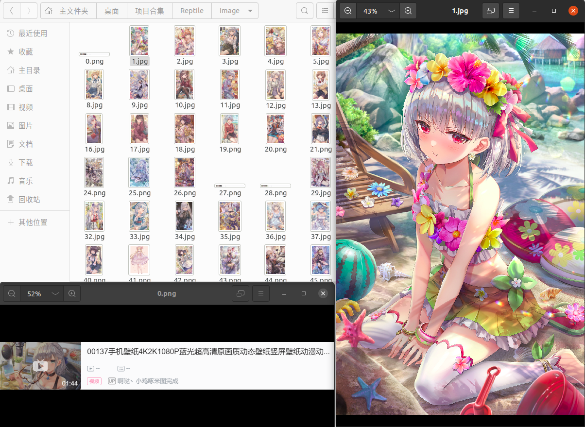
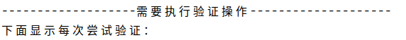
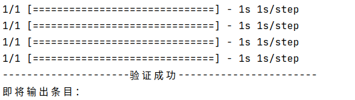
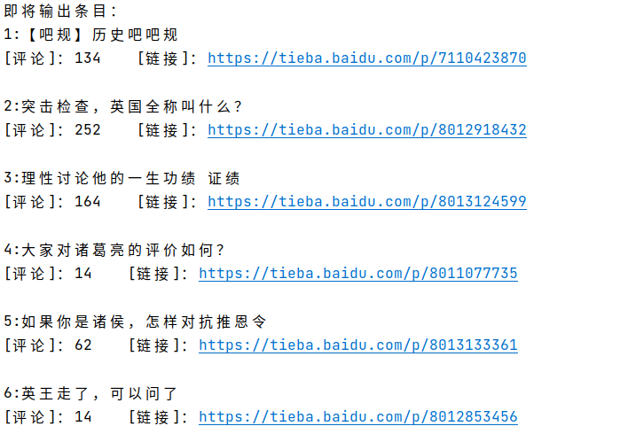
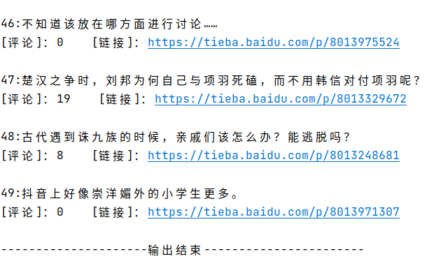
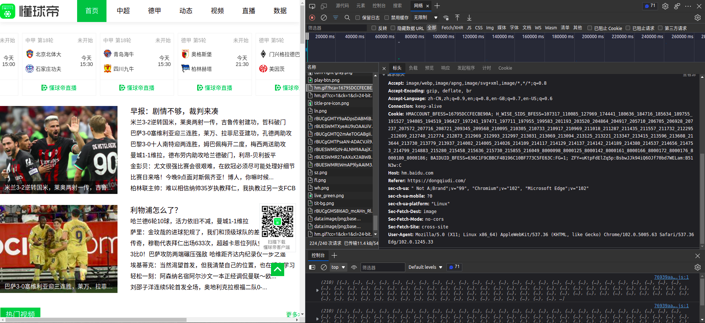

# Practical application of python crawler


We provide some functions to crawl videos and pictures from Bilibili. Based on these functional functions, we can choose to execute an item.
We provide some functions to crawl videos and pictures from Bilibili. Based on these functional functions, we can choose to execute an item.
For more convenient use, our function can input multiple cv numbers or bv numbers in the terminal (but not confusing) to achieve one-time download.

In the 2022.9.10 update, we added the articles that crawled Baidu Tieba's designated Tieba, and returned the title, number of comments and URL of each article. 
If you are interested in this title and the article has more comments, You can directly click the returned URL to visit

This series should be over, github can't always push it, especially for the models with more than 100M, I put the link of his network disk below, and it is due to be updated.

Download address of the model ：[model](https://pan.baidu.com/s/1CLCakhlxJE--0wQr3-tldA)

Extraction code： “phii”

You can click the link below to visit our github

[catch](https://github.com/wangxinyang27/catch)

## Prerequisites
- Linux
- Python 3
- CPU

### Getting started

- Clone this repo:
```bash
git clone https://github.com/wangxinyang27/catch.git 
```

### Use
The set of serial numbers of images or videos to be downloaded is fully represented as a string and separated by "/"，just like this：
```bash
“114514/170001/1234567/1919250”
```
For the articles of the column, the basic serial numbers are all letters, but the serial numbers of the videos are composed of upper and lower case letters and numbers, so we unify the commonly used strings
```bash
"1Tt411n7cK/1hD4y1X7Rm"
```

You can directly enter a string to indicate the name of the tieba you want to search for

```bash
"孙笑川"
```
We select the mode and the set of incoming serial numbers by adjusting the parameters. The complete code can be as follows:

#### Download audio

Before downloading Bilibili videos, you need to install ffmpeg

```bash
python main.py --catch_mode "video_frombv" --list_ "1Tt411n7cK/1hD4y1X7Rm"
```

<br>

The downloaded audio and synthesized video are stored in the directory 'Audio' and the directory 'Video' respectively

<br>
<br>

We can open them in the browser

<br>
<br>


#### Download images
```bash
python main.py --catch_mode "image_fromcv" --list_ "18351438/18354711"
```
<br>


<br>

for the column

<br>

We can find the ‘’Image’ we downloaded in Image

<br>


#### Get article information from the designated Tieba
```bash
python main.py --catch_mode "info_fromtieba" --list_ "历史"
```


When visiting the webpage of Baidu Tieba, a verification page may appear due to the anti-crawling 
mechanism—correcting the image by rotation. But only sometimes, in this case, the terminal will have the following output:

we cited the ways of [ShortCJL/RotateCode](https://github.com/ShortCJL/RotateCode/) and the model from 
[d4nst/RotNet](https://github.com/d4nst/RotNet/), and connected to Baidu Tieba

<br>
<br>


The terminal will display each verification. Generally, if the verification is successful twice, you can access the page
, and then enter the information of the article in the webpage, usually 50


<br>

last few items

<br>

We click on the second item of all output entries:

<br>

### Replenish
modules used
```bash
selenium == 4.43; tqdm == 4.64.0; requests == 2.27.1

bs, time, random, os, re, json, subprocess, argparse, importlib
```
We create a base class that contains some basic functions(base_fromxx.py), and then all derived classes(in video_frombv.py or image_fromcv.py) that implement various crawling content inherit from it.

We use ''webdriver'' (from selenium import webdiriver) to get web page content, here we use Firefox browser uniformly.

At the same time, we set options to prevent browser opening and pop-up, and set request headers to deal with some anti-crawling features of web pages.
```bash
'User-Agent': 'Mozilla/5.0 (X11; Linux x86_64) AppleWebKit/537.36 (KHTML, like Gecko) Chrome/102.0.5005.63 Safari/537.36 Edg/102.0.1245.33'
```
Because we are using a 64-bit linux operating system, the request headers will be different when you operate our code on windows.

Select a page, right-click 'Inspect', click 'Network' in the upper column, press 'ctrl+R' on the keyboard to refresh the content, and click any item in the name list on the left. Drag the information on the right to the bottom, you can see 'User-Agent' and its related information.

<br>

There will be a progress bar when downloading pictures and videos. In fact, it only plays a decorative role and cannot truly reflect the download speed. For details, see the function 'Procession' in base_fromxx.py

Ignore the file 'other.py', improve the code process for testing

### main reference from csdn
1. [Python进度条tqdm](https://blog.csdn.net/qq_38156104/article/details/110207081)
2. [python 爬虫前奏十一 配置Firefox选项](https://blog.csdn.net/qq_41399894/article/details/109158775)
3. [python爬虫，爬取哔哩哔哩视频](https://blog.csdn.net/weixin_52612318/article/details/118730607)
4. [python爬取时怎么获取头部header](https://blog.csdn.net/z2431435/article/details/110351053)
5. [Python之 requests的get方法](https://blog.csdn.net/dengyan1183/article/details/101319695)
6. [python爬虫之动态网页（以某宝、某猫、某东为例）](https://blog.csdn.net/weixin_42435368/article/details/117949273)
7. [linux下ffmpeg安装教程（小学生都能看懂）](https://blog.csdn.net/qq_29720657/article/details/107686681)


